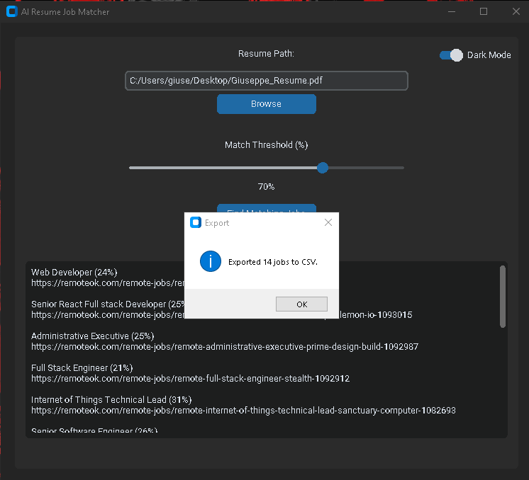
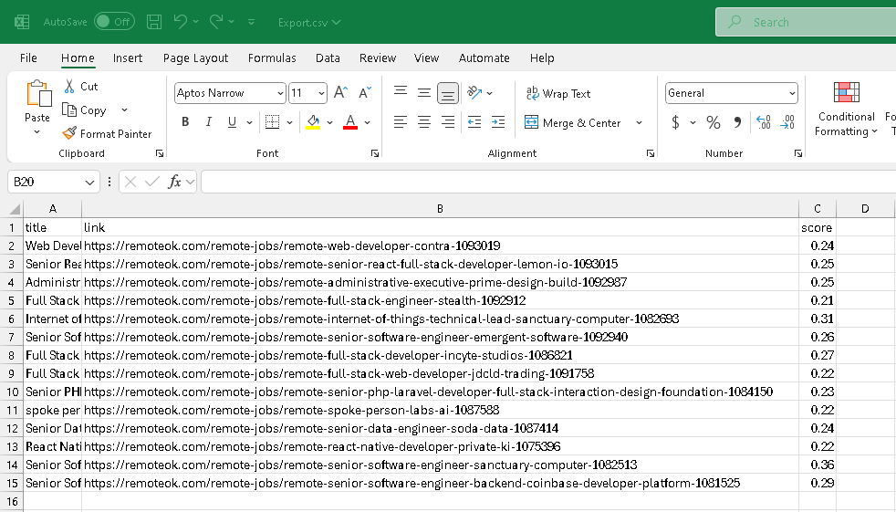

🤖 AI Resume Job Matcher

A free job matching assistant powered by AI sentence embeddings.  
Upload resume file, set a similarity threshold, and it finds job listings that match the skills.


---

## 🧩 Features

✅ Upload resume in `.pdf` or `.docx`  
✅ Scrapes live job listings from [RemoteOK](https://remoteok.com)  
✅ Uses AI to match resume to job descriptions  
✅ Adjustable similarity threshold (0%–100%)  
✅ Export to CSV  

---

## 🔍 How It Works

1. Resume is parsed into raw text.
2. It is converted into an **AI embedding** using `sentence-transformers`.
3. Job descriptions are also embedded.
4. Using **cosine similarity**, it finds the most semantically similar jobs.

---

## 🛠️ Built With

| Tool | Purpose |
|------|---------|
| `customtkinter` | Modern GUI framework for Python |
| `sentence-transformers` | Embeddings and semantic AI |
| `pdfminer.six` | PDF text extraction |
| `python-docx` | Word (DOCX) text parsing |
| `BeautifulSoup + requests` | Job listing scraping |
| `PyTorch` | Backend for embedding model |
| `RemoteOK` | Public job board used for scraping |

---

### 📦 Dependencies

```bash
pip install customtkinter sentence-transformers torch requests beautifulsoup4 pdfminer.six python-docx
```
---

### 📄 Upload &  Results


---

## 📤 Export

Click **"Export to CSV"** to save your matches for follow-up.




## 🧠 About the AI

This project uses the **MiniLM-L6-v2** model from [HuggingFace](https://huggingface.co/sentence-transformers/all-MiniLM-L6-v2) via the `sentence-transformers` library.  
It creates vector embeddings of your resume and compares them to job descriptions using cosine similarity — enabling deep semantic matching beyond keywords.

---
---
