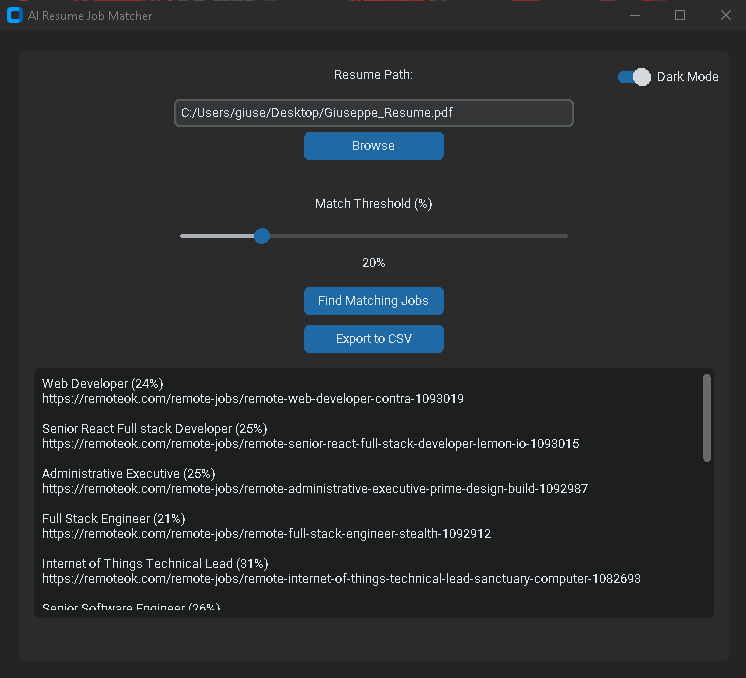

🤖 AI Resume Job Matcher

A smart, local, and fully free job-matching assistant powered by AI sentence embeddings.  
Upload your resume (PDF or DOCX), set a similarity threshold, and instantly find job listings that match your skills — all from a modern desktop GUI.

```

```

---

## 🧩 Features

✅ Upload resume in `.pdf` or `.docx`  
✅ Scrapes live job listings from [RemoteOK](https://remoteok.com)  
✅ Uses AI to match your resume to job descriptions  
✅ Adjustable similarity threshold (0%–100%)  
✅ Clickable job links  
✅ Export matches to CSV  
✅ Theme toggle: light / dark  
✅ Extracts top resume keywords (optional)

---

## 🔍 How It Works

1. Your resume is parsed into raw text.
2. It is converted into an **AI embedding** using `sentence-transformers`.
3. Job descriptions are also embedded.
4. Using **cosine similarity**, we find the most semantically similar jobs.
5. You see the matches in a sleek GUI — and can export or browse jobs instantly.

---

## 🛠️ Built With

| Tool | Purpose |
|------|---------|
| `customtkinter` | Modern GUI framework for Python |
| `sentence-transformers` | Embeddings and semantic AI |
| `pdfminer.six` | PDF text extraction |
| `python-docx` | Word (DOCX) text parsing |
| `BeautifulSoup + requests` | Job listing scraping |
| `PyTorch` | Backend for embedding model |
| `RemoteOK` | Public job board used for scraping |

---

## 🚀 Getting Started

### 📦 Install dependencies

```bash
pip install -r requirements.txt
```

Or manually:

```bash
pip install customtkinter sentence-transformers torch requests beautifulsoup4 pdfminer.six python-docx
```

### ▶️ Run the app

```bash
python resume_gui.py
```

---

---

## 📷 Screenshots

> _Add more as needed for visual documentation_

### 📄 Resume Upload

```

```

### 📊 Match Results

```

```

---

## 🧠 About the AI

This project uses the **MiniLM-L6-v2** model from [HuggingFace](https://huggingface.co/sentence-transformers/all-MiniLM-L6-v2) via the `sentence-transformers` library.  
It creates vector embeddings of your resume and compares them to job descriptions using cosine similarity — enabling deep semantic matching beyond keywords.

---

## 📤 Export Example

Click **"Export to CSV"** to save your matches for follow-up.

```
title, link, score
"Backend Developer", "https://...", 0.92
```

---
